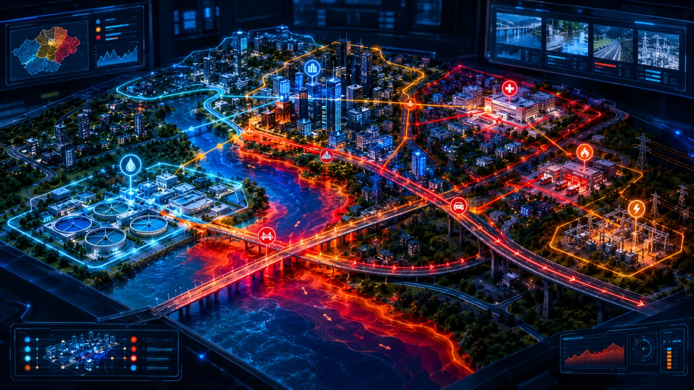
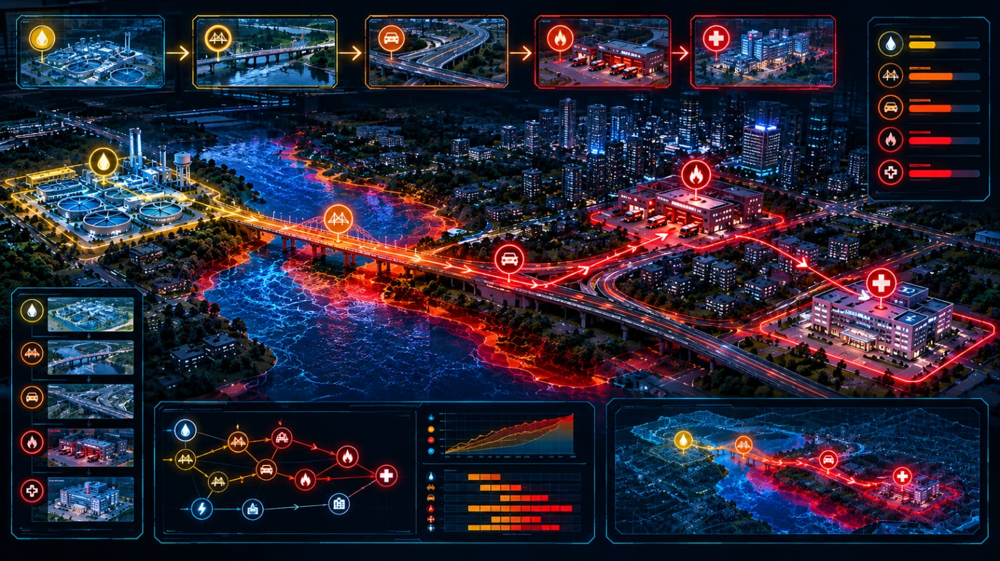

# 🚨 CivicShield-X

<div align="center">

### AI Autonomous Urban Crisis Digital Twin & Response Intelligence Platform

**Sense → Understand → Predict → Decide → Simulate → Verify → Replay → Remember**


<br>


</div>

> **CivicShield-X** is a research and software prototype for modeling urban crisis propagation, testing counterfactual response scenarios, and visualizing synthetic city risk.

> ⚠️ **Safety note:** Outputs are synthetic modeled results and are not real-world emergency forecasts, operational instructions, or public-safety decisions.

---

## Why CivicShield-X?

Urban crises rarely affect only one infrastructure component.

A flood can increase river levels, stress bridges, disrupt roads, delay emergency response, affect hospitals, and increase residential risk.

CivicShield-X represents these relationships as a connected digital-twin model and allows different response scenarios to be tested and compared.

---

## 🌐 Core Capabilities

- Synthetic city generation
- Multi-sensor crisis simulation
- AI anomaly detection
- Risk prediction and explainability
- Urban infrastructure dependency graph
- Crisis propagation simulation
- Multi-crisis fusion
- What-if scenario simulation
- Autonomous response evaluation
- Response plan comparison
- Future risk horizon
- Crisis Time Machine
- Living City digital twin
- City health scoring
- AI command assistant
- Crisis replay
- Crisis experiment laboratory
- Intervention synergy analysis
- Decision robustness analysis
- Automatic crisis reports
- Persistent city experiment memory

---

## System Architecture

```text
Synthetic City
      |
      v
Sensor Simulation
      |
      v
Anomaly + Risk Engine
      |
      v
Infrastructure Dependency Graph
      |
      v
Crisis Cascade Simulator
      |
      +-------------------+
      |                   |
      v                   v
 What-If Lab       Response Engine
      |                   |
      +---------+---------+
                |
                v
        Verify + Compare
                |
                v
        Replay + Memory


## 🏙️ Synthetic City Digital Twin

The default deterministic synthetic city contains 3 districts, 58,000 modeled population, 6 infrastructure nodes, and 6 dependency relationships.

Infrastructure includes the City Water Plant, River Bridge, North Highway, North Power Substation, Central Hospital, and Central Fire Station.

---

## 🔄 Crisis Intelligence Loop

**Sense -> Understand -> Predict -> Decide -> Simulate -> Verify -> Replay -> Remember**

Synthetic sensors generate rainfall, river level, traffic, power load, water pressure, and hospital load. The system detects anomalies, calculates modeled risk, simulates infrastructure cascades, evaluates counterfactual responses, verifies modeled effects, and stores experiments for later comparison.

---

## 🌧️ Example Flood Scenario

- Modeled risk: **65 / 100**
- Risk level: **HIGH**
- Affected infrastructure nodes: **6**
- Modeled population risk: **60.84**

Example propagation: City Water Plant -> River Bridge -> North Highway -> Emergency Response / Hospital / Riverside Residential Zone.

---

## 🧠 Explainable Risk

The risk engine identifies the sensor conditions contributing to the modeled risk score. Major flood drivers include rainfall, river level, and traffic stress.

---

## ⚠️ Anomaly Detection

The anomaly engine analyzes six simulated sensor streams and summarizes detected anomalies, severity, warnings, critical conditions, and modeled sensor health.

---

## 🌊 Multi-Crisis Fusion

CivicShield-X can combine Flood, Flood + Power, and Flood + Power + Fire scenarios to explore simultaneous disturbances.

---

## 🧪 What-If Crisis Lab

The What-If engine varies rainfall, river level, response delay, and bridge availability to generate counterfactual modeled risk results.

---

## 🤖 Autonomous Response Engine

<div align="center">

</div>

The response loop follows **Evaluate -> Simulate -> Verify -> Select**. Candidate interventions are simulated and compared against the baseline scenario.

---

## ⚔️ Response Plan Battle

Multiple modeled plans can be compared using risk, risk change, affected nodes, population risk, cascade impact, and recovery estimates.


## 🌆 Living City 2.0

<div align="center">

</div>

The Living City visualization represents the synthetic urban digital twin through districts, infrastructure nodes, dependency connections, modeled infrastructure status, cascade impact, and dependency strength. It is designed as a command-center style digital twin rather than a conventional static dashboard.

---

## ⏱️ Crisis Time Machine

The Crisis Time Machine generates counterfactual risk trajectories for different response delays.

Example modeled trajectory:

- 0 min -> **65.0 HIGH**
- 5 min -> **68.8 HIGH**
- 10 min -> **72.5 HIGH**
- 15 min -> **76.2 CRITICAL**
- 20 min -> **80.0 CRITICAL**

These trajectories are generated by the prototype model and are not real-world forecasts.

---

## 🔁 Crisis Replay

<div align="center">

</div>

Crisis Replay reconstructs the modeled incident as a chronological sequence of crisis detection and infrastructure cascade stages. This allows the same simulated event to be inspected as a timeline.

---

## 🧪 Crisis Experiment Lab

The Experiment Lab allows repeatable counterfactual experiments using rainfall, river level, response delay, and bridge availability.

Experiment results can be stored in **data/city_memory.json** so that previous modeled scenarios can be compared later.

---

## 🧬 Intervention Synergy

CivicShield-X can evaluate combinations of interventions and examine whether combined modeled actions produce different results from individual interventions.

The results describe relationships inside the synthetic simulation and should not be interpreted as operational emergency guidance.

---

## 🛡️ Decision Robustness Lab

The robustness engine stress-tests candidate actions across multiple modeled crisis conditions rather than evaluating an action under only one scenario.

The analysis reports modeled robustness, average risk reduction, and worst-case modeled risk for the tested scenarios.

---

## 💾 City Memory

CivicShield-X maintains persistent experiment memory using a JSON-based storage layer.

Stored experiment information can include:

- experiment name
- timestamp
- rainfall
- river level
- response delay
- bridge availability
- modeled risk score
- modeled risk level

This creates a simple memory layer for comparing previous digital-twin experiments.

---

## 📄 Automatic Crisis Reports

The Crisis Report Engine generates a structured Markdown report containing:

- scenario information
- modeled risk
- affected infrastructure
- population risk
- cascade impacts
- sensor state
- active risk drivers
- cascade stages
- model disclaimer

Reports can be downloaded directly from the dashboard.

---

## 💬 AI Command Assistant

The AI Command Assistant provides a natural-language interface to the current modeled system state.

Supported command categories include:

- risk explanation
- anomaly status
- cascade status
- what-if scenarios
- response status
- city health

Responses are generated from the CivicShield-X modeled state rather than external emergency data.


## 🧰 Technology Stack

### Core
- Python 3.14
- NumPy
- Pandas

### Visualization and Interface
- Streamlit
- Plotly

### API and Data
- FastAPI
- Pydantic
- Requests

### Development and Testing
- Git
- Python compile checks
- Deterministic simulation verification
- Automated project test modules
- AI-assisted development

---

## 📁 Project Structure

`	ext
CivicShield-X/
|
+-- app/
|   +-- core/
|   |   +-- anomaly.py
|   |   +-- cascade.py
|   |   +-- city_health.py
|   |   +-- city_memory.py
|   |   +-- command_assistant.py
|   |   +-- crisis_report.py
|   |   +-- experiment_engine.py
|   |   +-- robustness.py
|   |   +-- simulation.py
|   |   +-- synthetic_city.py
|   |   +-- time_machine.py
|   |   +-- what_if.py
|   |
|   +-- visuals/
|   |   +-- cascade_view.py
|   |   +-- living_city.py
|   |
|   +-- ui/
|       +-- dashboard.py
|
+-- assets/
|   +-- images/
|
+-- data/
|   +-- city_memory.json
|
+-- tests/
|   +-- test_cascade.py
|   +-- test_core.py
|
+-- requirements.txt
+-- README.md
+-- .gitignore
` 

---

## ⚙️ Installation

### 1. Clone the repository

After the public GitHub repository is created, clone it using its actual URL.

`powershell
git clone YOUR_PUBLIC_REPOSITORY_URL
cd CivicShield-X
` 

### 2. Install dependencies

`powershell
python -m pip install -r requirements.txt
` 

### 3. Run CivicShield-X

From the project root:

`powershell
C:\Users\sneha\OneDrive\Desktop\CivicShield-X = (Get-Location).Path
python -m streamlit run app/ui/dashboard.py --server.port 8513
` 

For the development environment used during this project, the existing virtual environment can be used directly with:

`powershell
.\\venv\\Scripts\\python.exe -m streamlit run app/ui/dashboard.py --server.port 8513 --server.headless true
` 

---

## 🧪 Verification

The CivicShield-X core pipeline has been verified across:

- sensor simulation
- risk calculation
- risk explanation
- anomaly detection
- cascade propagation
- city health calculation
- what-if simulation
- synthetic city generation
- command assistant
- crisis report generation
- multi-crisis simulation
- crisis timeline generation
- Living City digital twin generation

The project uses deterministic synthetic scenarios for reproducible development and demonstration.

---

## ⚠️ Limitations

CivicShield-X is a prototype digital-twin research system.

It does not:

- ingest certified live emergency infrastructure data
- provide certified emergency predictions
- control physical infrastructure
- issue public evacuation orders
- replace emergency-management professionals
- guarantee real-world outcomes

Its risk scores, response effects, recovery estimates, and robustness measurements are generated by synthetic and rule-based prototype models.

---

## 🤖 AI-Assisted Development Disclosure

AI coding assistance was used during development for implementation support, debugging, refactoring, documentation, testing workflows, and UI iteration.

The resulting system was locally executed, tested, debugged, and verified as part of project development.

---

## 🏆 GIBC V2

**Global Innovation Build Challenge V2**

**Track 03 - Open**

**Project:** CivicShield-X - AI Autonomous Urban Crisis Digital Twin & Response Intelligence Platform

The project demonstrates a functional software prototype combining synthetic urban sensing, infrastructure dependency modeling, crisis propagation, counterfactual simulation, response verification, explainability, replay, and persistent experiment memory.

---

## 🚀 Project Status

CivicShield-X is being prepared as a complete hackathon prototype with:

- functional core simulation
- interactive Streamlit interface
- Living City digital twin visualization
- crisis cascade visualization
- response simulation
- experiment memory
- automated reports
- reproducible synthetic scenarios
- documented source code


